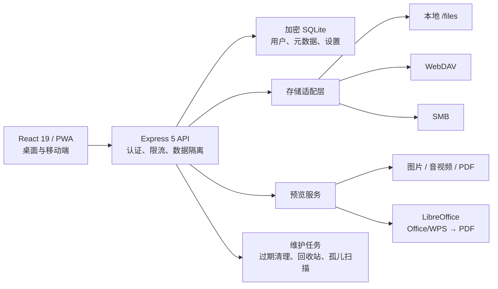

# 云粘贴 YunPaste

> 一套美观、安全、真正适合长期运行的自托管网络粘贴板与文件管理系统。


云粘贴把“临时粘贴文本”“跨设备传文件”“在线预览”“个人网盘”和“团队文件管理”
整合在一个统一界面里。它支持多用户、严格的用户数据隔离、文件夹、全文模糊搜索、
加密分享、文件生命周期、个人 WebDAV、全局 WebDAV/SMB 存储、工单与完整管理中心，
并提供桌面端文件管理器和接近原生 App 的手机体验。

项目面向个人、家庭、小团队和内网环境，使用标准 Docker Compose 部署。所有关键
数据都明确落在 `/config` 和 `/files`，可以自主管理、备份、迁移和恢复。

## 目录

- [为什么选择云粘贴](#为什么选择云粘贴)
- [功能全景](#功能全景)
- [文件预览能力](#文件预览能力)
- [系统架构](#系统架构)
- [快速部署](#快速部署)
- [安全与数据隔离](#安全与数据隔离)
- [数据库加密](#数据库加密)
- [WebDAV 与 SMB 存储](#webdav-与-smb-存储)
- [备份与恢复](#一致性备份)
- [本地开发](#本地开发)

## 为什么选择云粘贴

### 1. 隐私边界清晰，不把管理员变成“万能文件查看者”

每个用户的文件、文件夹、搜索结果、收藏、回收站和个人 WebDAV 都按用户隔离。
管理员负责用户、角色、配额和系统策略，但不能浏览其他用户的私有文件。文件分享
通过独立的高熵令牌访问，不能根据一个分享地址推导同一用户的其他文件。

### 2. 不只是“粘贴板”，而是一套完整文件管理器

“我的文件”支持文件夹、面包屑、列表/网格/图片视图、排序、分页、重命名、复制、
剪切、粘贴、移动到、复制到、收藏、回收站、批量选择和右键菜单。文本与文件使用
同一个“添加内容”入口，也支持拖拽和多文件上传，操作方式接近桌面文件管理器。

### 3. 强大的本地预览，私有文件不必交给第三方在线转换

图片、音频、视频、文本、Markdown 和 PDF 可直接预览；Word、Excel、PowerPoint、
WPS 与 OpenDocument 文档由容器内的 LibreOffice 转换为 PDF 后展示。预览读取仍受
用户身份、文件状态和短期访问凭据约束。

### 4. 本地存储与远端存储可以同时发挥作用

管理员可以把全局对象存储设为本地目录、WebDAV 或 SMB。每位用户还可以配置多个
独立的个人 WebDAV 连接，在远端执行上传、新建目录、重命名、复制、移动、删除、
下载与预览，并与“我的文件”双向传输。

### 5. 文件生命周期是内建能力

新内容默认保留 30 天，到期后自动清理；收藏的文件和文件夹永久保留。用户可以查看
即将过期内容，管理员可以调整默认保留期、过期提醒天数和回收站策略。分享链接可由
用户选择有效期，最长 7 天，并能随时撤销。

### 6. 为自托管安全做了工程化约束

- SQLite 数据库支持 AES-256 静态加密，并在密钥缺失或错误时拒绝启动。
- WebDAV/SMB 凭据使用独立密钥进行 AES-256-GCM 密封。
- 密码使用 bcrypt 哈希；认证、上传和公共分享端点具有速率限制。
- Docker 容器以 UID/GID `10001:10001` 非 root 用户运行。
- 根文件系统只读、移除全部 Linux capabilities，并启用 `no-new-privileges`。
- 文件直链使用短期签名，文件状态变化后会撤销已有访问能力。
- 配置备份使用 scrypt 派生密钥和 AES-256-GCM 加密，并支持先验证再恢复。

### 7. 手机端不是缩小版网页

响应式界面针对横屏和竖屏分别优化，具备移动顶部栏、底部导航、中央快捷添加按钮、
底部操作面板、大尺寸触控区域、安全区适配与横向卡片。项目同时提供 Web App
Manifest、Apple Touch Icon 和 Service Worker，可添加到手机桌面，以独立窗口运行。

### 8. 部署、维护和恢复路径清楚

程序只有两个核心持久目录：`/config` 保存数据库与应用密钥，`/files` 保存本地文件。
镜像提供健康检查、优雅停机、SQLite checkpoint、存储余量保护、远端操作并发队列、
日志轮转建议以及完整的备份和恢复说明，适合服务器长期运行。

## 功能全景

| 分类 | 能力 |
| --- | --- |
| 内容管理 | 纯文本、Markdown、单文件与多文件上传、拖拽上传、文件夹、批量操作 |
| 文件管理 | 列表/网格/图片视图、排序、分页、模糊搜索、重命名、复制、移动、回收站 |
| 在线预览 | 文本、图片、音视频、PDF、Office、WPS、OpenDocument |
| 分享 | 快速分享、高熵令牌、1/3/7 天有效期、随时撤销、过期时间展示 |
| 生命周期 | 默认 30 天、收藏永久保留、过期提醒、定时清理、回收站保留 |
| 用户系统 | 用户名或邮箱登录、普通用户/管理员角色、头像、资料与密码修改、账号注销 |
| 管理中心 | 用户与角色、配额、注册策略、上传限制、存储、保留期、安全与运行状态 |
| 远端文件 | 多个个人 WebDAV、全局 WebDAV/SMB、远端文件管理、双向传输 |
| 协作支持 | 用户工单、管理员回复、状态跟踪 |
| 外观体验 | 多套皮肤、响应式布局、桌面文件管理器、移动 App 式导航、PWA |
| 运维能力 | Docker Compose、健康检查、加密配置导入导出、备份恢复、优雅停机 |

默认每位用户拥有 20 GiB 配额。公开注册创建的账号始终为普通用户，只有管理员可以
调整角色和配额；主管理员还拥有系统名称等关键设置的修改权限。

## 文件预览能力

| 类型 | 示例格式 | 预览方式 |
| --- | --- | --- |
| 文本 | TXT、Markdown、JSON、日志和常见文本内容 | 浏览器内文本预览与一键复制 |
| 图片 | PNG、JPEG、GIF、WebP、SVG 等 | 自适应图片预览 |
| 音频 | MP3、WAV、M4A、AAC、FLAC、OGG、Opus | 原生音频播放器 |
| 视频 | MP4、WebM、MOV 等浏览器支持格式 | 原生视频播放器与 Range 流 |
| PDF | PDF | 同源嵌入式阅读 |
| Office | DOC/DOCX、XLS/XLSX、PPT/PPTX、RTF | LibreOffice 转换为 PDF |
| WPS | WPS、ET、DPS | LibreOffice 兼容转换 |
| OpenDocument | ODT、ODS、ODP | LibreOffice 转换为 PDF |

媒体能否播放仍取决于浏览器对具体编码器的支持。无法安全预览的格式会提供明确的
下载入口，不会把私有文件发送给外部在线预览服务。

## 系统架构



后端会在每次文件操作、搜索、预览和分享中绑定当前用户，而不是只依赖前端过滤。
SQLite 负责一致性元数据，存储适配层负责本地或远端对象；即使启用 WebDAV/SMB，
`/config` 仍必须使用可靠的本地块存储。

## 安全与数据隔离

云粘贴的权限模型遵循“默认私有”：

- 用户只能查询和操作属于自己的文件、文件夹、收藏、回收站和个人 WebDAV。
- 管理员接口不提供跨用户文件浏览能力。
- 公共分享只暴露被分享项目，并检查启用状态和过期时间。
- 下载和预览使用带过期时间的签名能力，不能替代用户身份长期访问。
- 文件移入回收站、恢复、删除或关闭分享后，旧访问能力会立即失效。
- 路径会经过规范化和归属验证，存储对象被替换为符号链接时拒绝读取。

这不等于免配置安全。公网部署必须使用 HTTPS、强管理员密码、可靠的密钥管理、
及时更新的反向代理和系统防火墙。安全问题请按 [SECURITY.md](SECURITY.md) 私下报告。

## 部署模型

生产镜像以 Node.js 24 运行，内置固定版本的 rclone 1.74.4，并同时支持
Linux `amd64` 与 `arm64`。应用进程使用固定 UID/GID `10001:10001`，根文件系统
只读，所有 Linux capabilities 均被移除。

容器只使用两个可写持久目录：

| 容器目录 | 内容 | 要求 |
| --- | --- | --- |
| `/config` | SQLite 数据库、自动生成的会话密钥、存储凭据密钥 | 必须是本机块存储，不得放在 NFS、SMB/CIFS、WebDAV 或其他网络文件系统 |
| `/files` | 本地对象、上传暂存区 | 本地存储模式下必须完整备份；使用远端存储时仍需要可靠的本地暂存空间 |

默认 Compose 使用 `yunpaste-config` 和 `yunpaste-files` 两个命名卷，分别映射到
`/config` 和 `/files`。配置、文件和密钥不再混放在单一数据目录。

SQLite 数据库只支持一个云粘贴应用实例。即使文件后端使用 WebDAV 或 SMB，也不要
对同一个 `/config` 启动多个副本，不要执行 `docker compose up --scale`。多人并发
由单实例内的数据库事务、存储预留和远端任务队列处理；扩容时应增加单实例 CPU、
内存和磁盘性能，而不是横向复制容器。

## 快速部署

需要 Docker Engine 和 Docker Compose v2。生产流量还应经过提供 HTTPS 的 Caddy、
Nginx、Traefik 或可信负载均衡器。

获取源码：

```bash
git clone https://github.com/Newterry/yunpaste.git
cd yunpaste
```

先准备环境文件和只读密钥目录：

```bash
cp .env.example .env
install -d -m 0700 secrets
openssl rand -base64 24
chmod 600 .env
```

把生成的随机值写入 `.env` 的 `ADMIN_PASSWORD`。首次生产启动要求密码至少 12
字节，建议使用密码管理器生成 16 字符以上的随机密码。`ADMIN_EMAIL` 和
`ADMIN_PASSWORD` 只在空数据库创建主管理员时使用；以后修改环境变量不会修改已有
账号。

校验、构建和启动：

```bash
docker compose config --quiet
docker compose build --pull
docker compose up -d --no-build --wait --wait-timeout 90
docker compose ps
curl -fsS http://127.0.0.1:8787/readyz
```

默认只绑定 `127.0.0.1:8787`，不要直接把 8787 暴露到公网。首次登录后应按实例用途
检查公开注册、上传上限、默认有效期和回收站保留期。

如需局域网访问，可在 `.env` 中设置 `TIEYUN_BIND=0.0.0.0`。这会监听宿主机所有
网络接口，仍应使用系统防火墙限制可信网段，并且不要在路由器上把该端口转发到公网。

### 使用宿主机目录

命名卷最省事，也能自动继承镜像内的非 root 权限。若希望数据直接出现在宿主机
固定目录，可在 `.env` 中指定绝对路径：

```dotenv
TIEYUN_CONFIG_VOLUME=/srv/yunpaste/config
TIEYUN_FILES_VOLUME=/srv/yunpaste/files
TIEYUN_SECRETS_PATH=/srv/yunpaste/secrets
```

在 Linux 上先创建目录并授予容器用户权限：

```bash
sudo install -d -o 10001 -g 10001 -m 0700 \
  /srv/yunpaste/config /srv/yunpaste/files
sudo install -d -o root -g 10001 -m 0750 /srv/yunpaste/secrets
```

云粘贴不会以 root 身份修复绑定目录。目录不可读写时，入口程序会明确报错并退出，
而不是降低权限保护。不要为了绕过权限错误而使用 `chmod 777`。

## 环境变量

`docker-compose.yml` 支持下列变量：

| 变量 | 默认值 | 作用 |
| --- | --- | --- |
| `TIEYUN_IMAGE_TAG` | `1.13.0` | 构建标签和运行版本 |
| `TIEYUN_BIND` | `127.0.0.1` | 宿主机监听地址 |
| `TIEYUN_PORT` | `8787` | 宿主机监听端口 |
| `TIEYUN_CONFIG_VOLUME` | `yunpaste-config` | 映射到 `/config` 的命名卷或绝对路径 |
| `TIEYUN_FILES_VOLUME` | `yunpaste-files` | 映射到 `/files` 的命名卷或绝对路径 |
| `TIEYUN_SECRETS_PATH` | `./secrets` | 只读映射到 `/run/secrets` 的宿主机目录 |
| `ADMIN_EMAIL` | `admin@yunpaste.local` | 空数据库首次创建主管理员时使用 |
| `ADMIN_PASSWORD` | 空 | 首次主管理员密码；也可改用 `ADMIN_PASSWORD_FILE` |
| `ADMIN_PASSWORD_FILE` | 空 | 首次主管理员密码文件的容器内路径 |
| `ALLOW_INSECURE_ADMIN_CREDENTIALS` | `false` | 仅隔离测试：允许非邮箱管理员账号和短密码 |
| `JWT_SECRET` | 空 | 会话签名密钥；通常让系统在 `/config` 自动生成 |
| `JWT_SECRET_FILE` | 空 | 外部会话签名密钥文件的容器内路径 |
| `DATABASE_KEY_FILE` | 空 | 数据库加密密钥文件的容器内路径 |
| `STORAGE_SECRET_FILE` | 空 | WebDAV/SMB 凭据加密密钥文件的容器内路径 |
| `TRUST_PROXY` | `false` | Express 信任的代理跳数；单层可信代理通常设为 `1` |
| `MIN_FREE_BYTES` | `268435456` | `/files` 必须保留的最小空间，默认 256 MiB |
| `REMOTE_STORAGE_TIMEOUT_MS` | `120000` | 单次远端存储操作的常规超时 |
| `REMOTE_STORAGE_CONCURRENCY` | `8` | rclone 远端任务并发上限，允许 1–64 |
| `REMOTE_STORAGE_QUEUE_LIMIT` | `128` | 等待中的远端任务上限 |
| `VCS_REF` | `unknown` | 写入 OCI 镜像标签的源码修订号 |

容器内的 `CONFIG_DIR=/config`、`FILES_DIR=/files`、`RCLONE_PATH` 和
`SEED_DEMO_DATA=false` 已由 Compose 固定，无需在 `.env` 中重复设置。

远端并发值要根据 WebDAV/SMB 服务端限制、网络时延和实例内存逐步调节。设置太大
可能触发远端限流或让并发预览挤占上传资源；队列满时系统会快速拒绝新任务，避免
无限堆积。

## 密钥文件

生产数据库密钥只允许通过文件提供，不接受 `DATABASE_KEY` 环境变量。密钥文件应
位于 `TIEYUN_SECRETS_PATH` 对应的独立目录，并使用容器内路径配置，例如：

```dotenv
ADMIN_PASSWORD=
ADMIN_PASSWORD_FILE=/run/secrets/admin-password
DATABASE_KEY_FILE=/run/secrets/database.key
STORAGE_SECRET_FILE=/run/secrets/storage.key
```

生成文件：

```bash
openssl rand -base64 24 > secrets/admin-password
openssl rand -hex 32 > secrets/database.key
openssl rand -hex 32 > secrets/storage.key
sudo chown root:10001 secrets/admin-password secrets/database.key secrets/storage.key
sudo chmod 0440 secrets/admin-password secrets/database.key secrets/storage.key
```

如果不设置 `JWT_SECRET_FILE`，系统会自动生成 `/config/.jwt-secret`。如果不设置
`STORAGE_SECRET_FILE`，系统会自动生成 `/config/.storage-secret`。两者都会以
`0600` 保存。外部密钥文件和自动生成的密钥都必须保持稳定：

- 丢失数据库密钥后，加密数据库无法恢复。
- 丢失存储凭据密钥后，数据库中的 WebDAV/SMB 密码无法解密。
- 更换或丢失 JWT 密钥会让所有现有登录会话失效。
- 首次管理员密码文件在账号创建后不再用于认证，但仍不应长期保留明文副本。

密钥必须与数据备份分开加密保存，但恢复演练必须同时验证两者匹配。不要把
`secrets/`、`.env`、数据库密钥或远端密码提交到版本库、工单和日志。

## 数据库加密

云粘贴使用 `better-sqlite3-multiple-ciphers`，以 SQLite3MultipleCiphers 的
SQLCipher legacy 4 / AES-256 模式加密数据库。数据库加密保护 `/config` 中的
数据库内容静态落盘，不会自动加密 `/files` 中的用户文件，也不替代磁盘加密、
TLS、访问控制或备份加密。

### 全新部署直接启用

在第一次 `docker compose up` 前生成 `secrets/database.key`，并在 `.env` 设置：

```dotenv
DATABASE_KEY_FILE=/run/secrets/database.key
```

空数据库会从创建开始保持加密。启动后可检查状态：

```bash
docker compose run --rm --no-deps yunpaste \
  node server/cli.mjs database status
```

### 将现有明文数据库停机加密

数据库迁移必须停机，不能对正在运行的 SQLite 文件执行：

```bash
set -e

docker compose stop yunpaste
openssl rand -hex 32 > secrets/database.key
sudo chown root:10001 secrets/database.key
sudo chmod 0440 secrets/database.key
```

随后在 `.env` 设置：

```dotenv
DATABASE_KEY_FILE=/run/secrets/database.key
```

执行原子迁移和完整性检查：

```bash
docker compose run --rm --no-deps yunpaste \
  node server/cli.mjs database encrypt \
  --key-file /run/secrets/database.key

docker compose run --rm --no-deps yunpaste \
  node server/cli.mjs database status

docker compose up -d --wait --wait-timeout 90
```

服务启动会实际验证密钥；密钥错误、加密库缺少密钥，或明文库提前配置密钥时都会
拒绝启动，防止旁路创建新的空数据库。

迁移命令可附加 `--keep-plaintext-backup` 保留恢复副本，但该副本完全未加密，并且
位于 `/config`。仅在受控维护中使用，验证新库后立即把它移到加密的离线介质或安全
删除。系统当前不提供在线换钥；不要用第三方 SQLite 工具直接修改正在运行的库。

## WebDAV 与 SMB 存储

远端存储由镜像内固定的 rclone 1.74.4 作为客户端访问。云粘贴不会挂载 FUSE/CIFS，
不会要求特权容器，也不会在主机上创建 `rclone.conf`。每次操作通过受控子进程和
临时环境配置远端，密码不会作为命令行参数传递。

### WebDAV

- 使用不包含用户名和密码的完整 HTTP(S) URL。
- 生产环境应使用受信任证书的 HTTPS。
- 普通 `http://` 地址只有在管理界面显式允许不安全连接时才会接受。
- 可选择通用、Fastmail、Nextcloud、ownCloud、Infinite Scale、SharePoint、
  SharePoint NTLM 或 rclone WebDAV 类型。
- `basePath` 是该 WebDAV 根目录下由云粘贴管理的子目录。

### SMB

- 分别填写主机名、端口（默认 445）、共享名、用户名（必填；来宾服务可填
  `guest`）、域（默认 `WORKGROUP`）和
  可选 `basePath`。
- 容器必须能通过网络访问 SMB 主机的 TCP 445 或自定义端口。
- 共享名只填写一级 share，不要把 `smb://` URL 或子目录混入共享名；子目录放在
  `basePath`。
- 不要把 SQLite 所在的 `/config` 放到该 SMB 共享。SMB 只用于文件对象。

管理中心的“测试连接”会在目标目录写入、读回并删除一个很小的健康文件，因此远端
账号必须具备创建、读取和删除权限。测试会改变远端状态，应在专用目录中进行。

切换活动后端只影响后续写入；系统会按文件记录原后端。只要旧文件仍被引用，就必须
保留对应远端目录、账号和访问路径。不要在管理界面切换成功后立即清空旧后端。

WebDAV/SMB 密码在写入数据库前使用 AES-256-GCM 密封，密钥来自
`STORAGE_SECRET_FILE` 或 `/config/.storage-secret`。该保护不等于文件内容端到端
加密；文件是否静态加密取决于远端服务、磁盘和备份策略。

## 健康检查与监控

- `/livez`：Node 进程可响应。
- `/readyz`：数据库、持久目录和最低存储余量的就绪状态。
- `/health`：与 readiness 等价的运维端点。
- `/api/version`：运行版本。

Docker 每 30 秒调用 `/readyz`，连续失败会标记为 `unhealthy`。`restart:
unless-stopped` 只在进程退出后重启，不会因为 `unhealthy` 自动重启，因此应让外部
监控对 unhealthy、5xx、存储余量和远端后端错误告警。

```bash
docker compose ps
docker compose logs --tail=200 yunpaste
curl -fsS http://127.0.0.1:8787/livez
curl -fsS http://127.0.0.1:8787/readyz
docker compose run --rm --no-deps yunpaste rclone version
docker stats --no-stream
```

建议监控 `/config` 和 `/files` 所在磁盘、远端容量、最近成功备份、容器重启次数、
请求延迟以及反向代理的 4xx/5xx。Compose 将本地 JSON 日志限制为 10 MiB × 3；
长期日志应发送到外部系统，并避免采集认证头、请求正文、私有文件名或密钥。

## 反向代理

同机单层反向代理通常使用：

```dotenv
TIEYUN_BIND=127.0.0.1
TRUST_PROXY=1
```

代理必须覆盖而不是追加客户端提供的 `X-Forwarded-For`、`X-Forwarded-Host` 和
`X-Forwarded-Proto`，并关闭上传请求缓冲。最大请求体和超时应不小于管理中心设置
的上传上限。不要在客户端可以绕过代理直连应用时启用 `TRUST_PROXY`。

Nginx 核心配置示例：

```nginx
location / {
    proxy_pass http://127.0.0.1:8787;
    proxy_http_version 1.1;
    proxy_request_buffering off;
    proxy_buffering off;
    proxy_read_timeout 1800s;
    proxy_send_timeout 1800s;
    client_max_body_size 2g;
    proxy_set_header Host $host;
    proxy_set_header X-Real-IP $remote_addr;
    proxy_set_header X-Forwarded-For $remote_addr;
    proxy_set_header X-Forwarded-Host $host;
    proxy_set_header X-Forwarded-Proto $scheme;
}
```

TLS、证书续期、HTTP 到 HTTPS 跳转和公网防火墙由反向代理或负载均衡器负责。健康
端点建议只允许本机或监控网段访问。

## 一致性备份

数据库元数据和文件对象必须作为一个恢复单元理解。不要在应用运行时直接 `tar`
数据卷；上传、回收站清理或 WAL 写入可能让备份处于不同时间点。

本地存储的离线备份示例：

```bash
set -euo pipefail

BACKUP_DIR="$PWD/backups"
STAMP="$(date -u +%Y%m%dT%H%M%SZ)"
IMAGE="$(docker compose config --images | head -n 1)"
install -d -m 0700 "$BACKUP_DIR"

docker compose stop yunpaste
docker run --rm --user 0:0 --entrypoint sh \
  -e STAMP="$STAMP" \
  -v yunpaste-config:/source/config:ro \
  -v yunpaste-files:/source/files:ro \
  -v "$BACKUP_DIR:/backup" \
  "$IMAGE" \
  -c 'tar -C /source -czf "/backup/yunpaste-${STAMP}.tgz" config files'
docker compose start yunpaste
```

如果通过 `TIEYUN_CONFIG_VOLUME`/`TIEYUN_FILES_VOLUME` 使用绑定目录，请把命令中的
两个卷名换成对应绝对路径，例如
`-v /srv/yunpaste/config:/source/config:ro`。

使用 WebDAV 或 SMB 时，上述归档只包含数据库、密钥和本地暂存数据，不包含远端
对象。保持应用停机，在同一个维护窗口对远端专用目录执行服务端快照或独立备份，
并记录与数据库归档匹配的时间点。远端存储不是备份。

另外对 `secrets/` 做独立加密备份。至少恢复验证：

1. `/config/yunpaste.db` 与可能存在的 WAL/SHM 文件。
2. `/config/.jwt-secret` 和 `/config/.storage-secret`，或对应外部密钥。
3. `/files/objects` 中的本地对象，或同一时间点的 WebDAV/SMB 对象。
4. `DATABASE_KEY_FILE`、`STORAGE_SECRET_FILE` 和外部 JWT 密钥。
5. 文件预览、Range 下载、登录、管理设置和远端连接。

定期执行离线恢复演练；“归档命令成功”不等于数据可恢复。

## 从旧版单目录迁移

1.1.x 的默认卷 `tieyun-data` 使用 `/app/data/tieyun.db` 和
`/app/data/uploads`。升级到 1.2.0 前先备份并让旧容器正常停止，使 WAL 完成
checkpoint。新布局对应关系为：

| 旧路径 | 新路径 |
| --- | --- |
| `/app/data/tieyun.db` | `/config/yunpaste.db` |
| `/app/data/.jwt-secret` | `/config/.jwt-secret` |
| `/app/data/uploads/*` | `/files/objects/*` |

确认旧卷中 `tieyun.db-wal` 不存在或大小为 0 后再复制。若它仍有内容，先重新启动
旧版本并正常停止，不能只复制主数据库文件。不要在没有备份的情况下删除
`tieyun-data`。

构建 1.2.0 镜像后，可用下面的一次性容器完成默认命名卷迁移。命令会在目标数据库
已经存在或旧 WAL 仍有内容时安全失败：

```bash
set -euo pipefail

IMAGE="$(docker compose config --images | head -n 1)"
docker volume create yunpaste-config
docker volume create yunpaste-files

docker run --rm --user 0:0 --entrypoint sh \
  -v tieyun-data:/old:ro \
  -v yunpaste-config:/config \
  -v yunpaste-files:/files \
  "$IMAGE" -eu -c '
    test -f /old/tieyun.db
    test ! -e /config/yunpaste.db
    if [ -s /old/tieyun.db-wal ]; then
      echo "旧数据库 WAL 仍有内容，请先用旧版本正常启动并停止" >&2
      exit 1
    fi
    mkdir -p /files/objects /files/staging
    cp /old/tieyun.db /config/yunpaste.db
    if [ -f /old/.jwt-secret ]; then
      cp /old/.jwt-secret /config/.jwt-secret
    fi
    if [ -d /old/uploads ]; then
      cp -a /old/uploads/. /files/objects/
    fi
    chown -R 10001:10001 /config /files
    chmod 0700 /config /files /files/objects /files/staging
    chmod 0600 /config/yunpaste.db
  '
```

迁移后先启动并验证登录、文件预览和下载，再按备份保留策略处理旧卷。使用宿主机
绑定目录时，将命令中的目标卷名替换为目标绝对路径。

## 升级与回滚

升级前先阅读变更、执行离线备份并保留原版本镜像标签：

```bash
docker compose stop yunpaste
docker compose build --pull
docker compose up -d --no-build --wait --wait-timeout 90
docker compose logs --tail=200 yunpaste
```

数据库迁移可能使旧镜像无法读取新结构。回滚应恢复升级前的 `/config`、`/files`、
远端对象快照和密钥，而不是只把镜像标签改回去。

容器收到 SIGTERM 后会停止接收新连接、等待进行中的维护并 checkpoint SQLite。
Compose 提供 40 秒停止宽限期。主机重启、强制 `kill -9` 或磁盘故障仍可能打断
写入，因此不能替代可靠存储和可验证备份。

## 本地开发

```bash
npm ci
npm run dev
```

生产构建和测试：

```bash
npm run check
npm test
npm run build
```

本地开发默认使用仓库下的 `config/` 与 `files/`；旧测试和旧环境若仅设置
`DATA_DIR`，仍会启用一版兼容布局。新部署应只使用 `CONFIG_DIR` 与 `FILES_DIR`，
不要同时混用。

## 参与贡献

欢迎提交问题、改进文档和贡献代码。开始前请阅读
[CONTRIBUTING.md](CONTRIBUTING.md)。涉及漏洞、认证绕过、文件越权或密钥泄露的
问题不要创建公开 Issue，请按 [SECURITY.md](SECURITY.md) 的方式私下报告。

## 开源许可

云粘贴使用 [MIT License](LICENSE) 开源。你可以自由使用、修改和分发，但软件按
“现状”提供，不附带任何明示或暗示担保。
